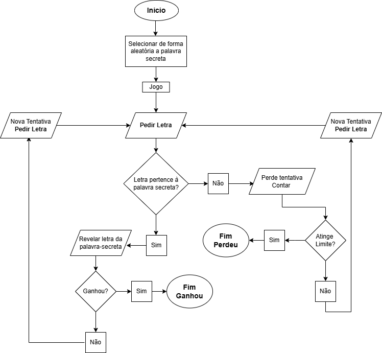

# Jogo da Forca

# Objetivo do jogo:
  O jogador deve descobrir a palavra secreta, adivinhando uma letra de cada vez, antes que se esgote o número máximo de tentativas disponíveis.

# Regras principais:
  * a palavra secreta é apresentada inicialmente apenas com traços (_), que representam o número total de letras;
  * cada rodada, o jogador insere uma letra;
  * se a letra existir, esta é revelada;
  * se a letra não existir, o jogador perde a tentativa e o contador de erros aumenta.

# Condições para a vitória ou derrota:
  - Vitória: o jogador descobre a palavra secreta antes de atingir o limite máximo de erros;
  - Derrota: o jogador não consegue descobrir a palavra secreta antes de atingir o limite máixmo de erros.

# Limitações e inputs:
  - Número máximo de erros: 6
  - Inputs: letras de A a Z
  - Letras: o jogo deve ser case insensitive, para permitir o tratamento de maiúsculas e minúsculas

# Requisitos Funcionais (RF):
RF01: O programa deve selecionar aleatoriamente uma palavra de uma lista pré-definida.

RF02: O programa deve exibir a palavra secreta (ex: _ _ _ _), revelando as letras conforme o utilizador acerta.

RF03: O programa deve validar se o input do utilizador é apenas uma letra (e não números ou múltiplos caracteres).

RF04: O programa deve descontar uma tentativa apenas quando a letra escolhida não existir na palavra.

RF05: O programa deve manter um histórico das letras já tentadas para evitar repetições.

RF06: O programa deve exibir uma mensagem clara de "Vitória" ou "Derrota" ao finalizar o jogo.

# Requisitos Não Funcionais (RNF):
RNF01 (Usabilidade): O jogo deve ser intuitivo, correndo inteiramente no terminal.

RNF02 (Portabilidade): O código deve ser compatível com qualquer sistema que tenha o Python instalado.

RNF03 (Robustez): O sistema deve ser insensível a maiúsculas e minúsculas (tratando 'A' e 'a' como a mesma letra).

## Fluxograma da Lógica do Jogo
  

# Instruções para utilização do jogo:
1. Certifica-te que tens instalado o Python 3 no teu terminal;
2. O Python 3 é essencial para correr o jogo, por terem sido utilizadas duas bibliotecas aí existentes: random e os;
3. Faz download do ficheiro (forca.py);
4. No teu terminal, navega até à pasta (cmd, VS Code, etc.);
5. Executa o ficheiro.

# Exemplo de utilização:
1. Ao abrires o jogo, será apresentado o quadro onde estará a palavra secreta que terás que adivinhar;

   
2. No teu terminal, deve digitar uma letra do alfabeto e de seguida clicar em ENTER;  
3. O jogo irá devolver o resultado final dessa ação, validando se foi o palpite válido ou não;
   
   

4. O jogo continuará até atingires o limite máximo de palpites errados (6) ou descobrires a palavra secreta.
   
   

5. Bom jogo!
